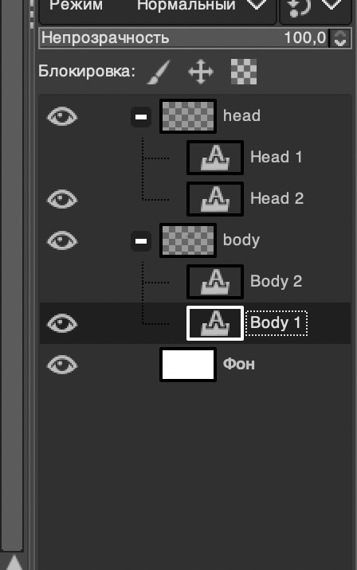

# GIMP python-fu script

Produce all possible combinations for Layers inside root GroupLayers and save resulting images to out_path.

## Usage

Change path and file base name in top of script:

        out_path = '/Users/antonkrutikov/Downloads/out'
        file_base_name = 'temp'

Paste script in gimp python-fu console, hit Enter

For this structure result will be 4 images:
- temp0.png: Head1 + Body1
- temp1.png: Head1 + Body2
- temp2.png: Head2 + Body1
- temp3.png: Head2 + Body2